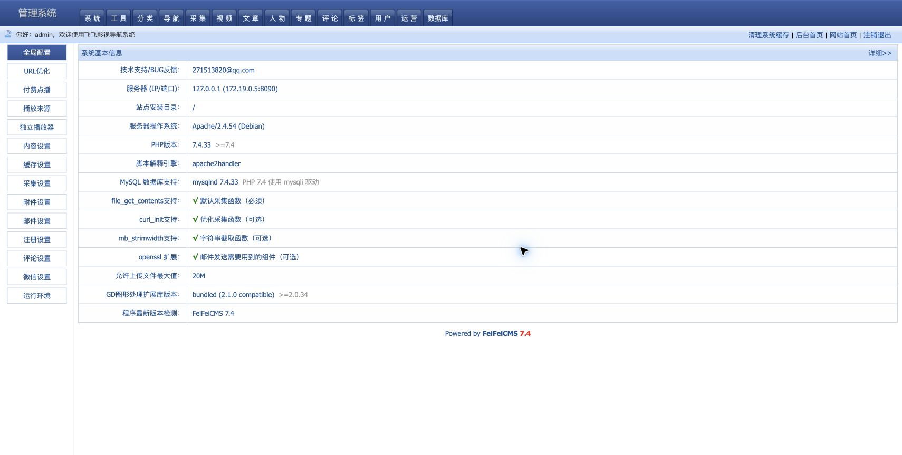
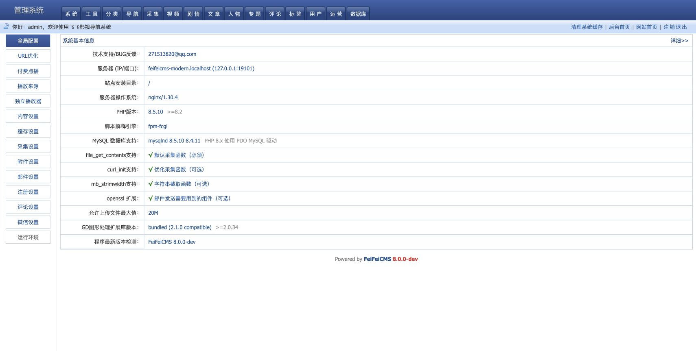

# FeiFeiCMS 系统首页视觉对比

同一 Chrome 内容视口：1710 × 863 px。参考页与实现页都使用真实运行数据，并在登录态下重新加载后截图。

## FeiFeiCMS 7.4 参考页

## ThinkPHP 8 / PHP 8.x 实现页

## 核对结果

- 顶栏高度、主导航、欢迎条和右侧操作保持原版结构。
- 左栏为 140 px，14 个系统入口顺序与默认选中状态一致。
- 内容表格起点、标签列、14 行字段、表格底边和页脚落位与参考页对齐。
- 运行环境值取自当前 PHP 8.5、MySQL 8.4、Nginx/FPM 环境，不伪装为旧版本。
